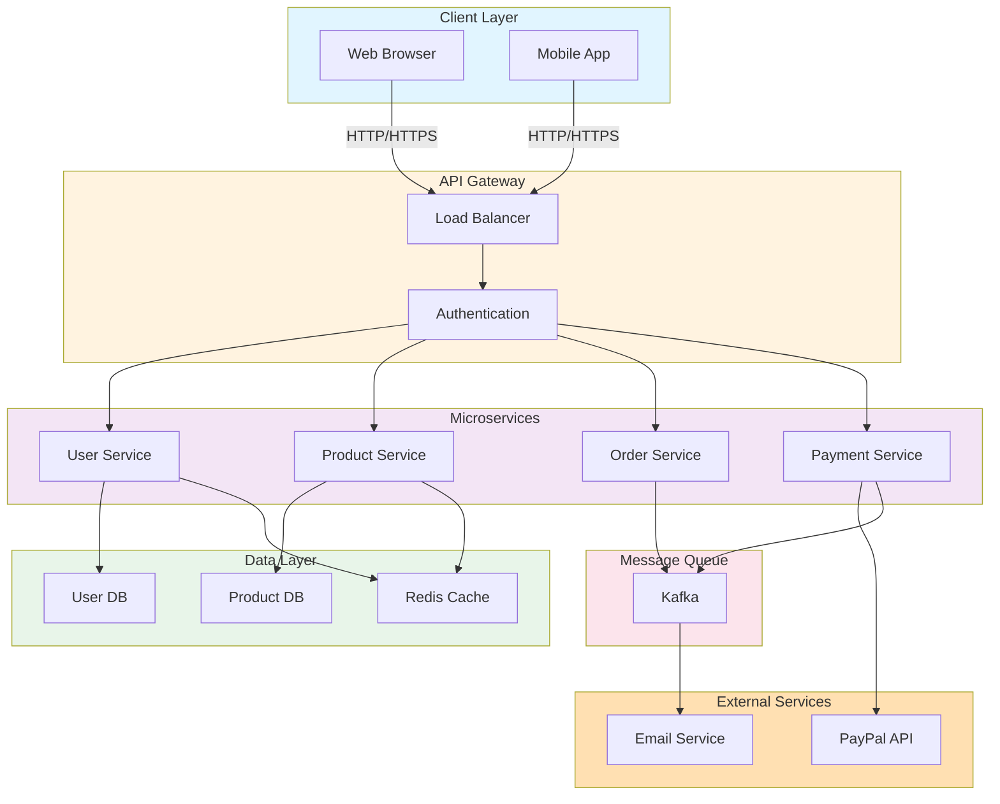

# System Architecture Overview

This document provides a visual overview of the system architecture and component interactions.

## Architecture Diagram

## Component Descriptions

### Client Layer
- **Web Browser**: Frontend application accessed via web
- **Mobile App**: Native or cross-platform mobile application

### API Gateway
- **Load Balancer**: Distributes incoming requests across servers
- **Authentication**: Handles user authentication and authorization

### Microservices
- **User Service**: Manages user profiles and authentication
- **Product Service**: Handles product catalog and inventory
- **Order Service**: Processes customer orders
- **Payment Service**: Manages payment processing and transactions

### Data Layer
- **User DB**: Stores user account information
- **Product DB**: Stores product and inventory data
- **Redis Cache**: Provides caching for frequently accessed data

### Message Queue
- **Kafka**: Event streaming platform for asynchronous communication

### External Services
- **PayPal API**: Third-party payment processing
- **Email Service**: Notification and transactional emails

## Data Flow

1. Client requests flow through the Load Balancer
2. Requests are authenticated via the Authentication service
3. Authenticated requests are routed to appropriate microservices
4. Services interact with their respective databases and cache
5. Asynchronous operations are queued in Kafka
6. External services are called for specialized functions (payments, emails)

## Benefits of This Architecture

- **Scalability**: Microservices can be scaled independently
- **Reliability**: Service isolation prevents cascade failures
- **Flexibility**: Easy to add new services or external integrations
- **Performance**: Caching and async processing improve response times
- **Maintainability**: Clear separation of concerns across services
